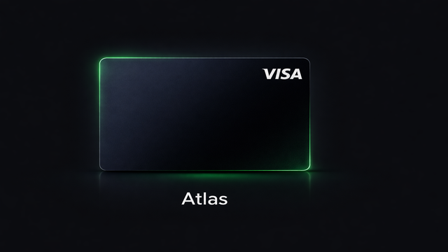

# Atlas — виртуальные Visa карты в Telegram

Telegram-бот + Mini App для продажи виртуальных Visa-карт номиналом в долларах
для оплаты зарубежных сервисов (ChatGPT, Claude, Cursor, Spotify, Netflix,
Midjourney и других). Выдача автоматическая через провайдеров Bitrefill /
Reloadly, оплата в рублях через СБП (YooKassa).



## Возможности

- Telegram Mini App (React + Tailwind) с каталогом карт, страницей оплаты и
  выдачи реквизитов.
- Telegram-бот на aiogram 3 с пользовательскими командами (`/start`,
  `/help`, `/support`) и админ-панелью (`/admin`) — статистика, заказы,
  управление курсом и продуктами, health-check.
- FastAPI-бэкенд с асинхронной SQLAlchemy 2.0, PostgreSQL и Redis.
- Динамический курс USD/RUB с источником Bybit, сглаживанием и настраиваемой
  маржой / наценкой.
- Приём платежей через YooKassa и вебхуки провайдеров.
- Шифрование чувствительных данных карт (`cryptography` / Fernet).
- Миграции Alembic.
- Полный `docker-compose.yml` для запуска всего стека.

## Архитектура

```
┌────────────┐   HTTPS    ┌────────────┐   asyncpg   ┌──────────────┐
│  Frontend  │ ─────────▶ │  Backend   │ ──────────▶ │  PostgreSQL  │
│ (Netlify)  │            │ (FastAPI)  │             └──────────────┘
└─────┬──────┘            │            │             ┌──────────────┐
      │ WebApp            │            │ ──────────▶ │    Redis     │
      ▼                   │            │             └──────────────┘
┌────────────┐   HTTP     │            │   HTTPS     ┌──────────────┐
│    Bot     │ ─────────▶ │            │ ──────────▶ │  Bitrefill / │
│ (aiogram)  │            │            │             │  Reloadly /  │
└────────────┘            └────────────┘             │   YooKassa   │
                                                     └──────────────┘
```

### Структура репозитория

```
cardbot/
├── backend/          # FastAPI приложение
│   └── app/
│       ├── main.py           # входная точка, CORS, роутеры, lifespan
│       ├── config.py         # pydantic-settings, переменные окружения
│       ├── database.py       # async engine / session
│       ├── models/           # SQLAlchemy модели (User, Product, Order, ExchangeRate)
│       ├── routers/          # products, orders, webhooks, rate, admin
│       ├── providers/        # интеграции Bitrefill / Reloadly
│       ├── services/         # pricing, payment, card_service
│       ├── security/         # шифрование, валидация Telegram initData
│       └── tasks/            # фоновая задача обновления курса
├── bot/              # Telegram-бот на aiogram 3
│   └── bot.py
├── frontend/         # React + Vite + TypeScript + Tailwind
│   └── src/
│       ├── pages/    # Catalog, Product, Payment, Card, MyCards, Help
│       ├── components/  # CardVisual, CopyButton, PriceTag
│       ├── hooks/       # useTelegram
│       └── api/
├── alembic/          # миграции БД
├── docker-compose.yml
└── .env.example
```

## Быстрый старт

### Требования

- Docker и Docker Compose
- Telegram-бот (токен от [@BotFather](https://t.me/BotFather))
- Магазин YooKassa (shop_id + secret_key)
- API-ключ Bitrefill (и/или учётка Reloadly)

### 1. Клонирование и переменные окружения

```bash
git clone git@github.com:gitPHhuber/tg_card_bot.git cardbot
cd cardbot
cp .env.example .env
```

Заполните `.env`:

| Переменная | Описание |
|---|---|
| `BOT_TOKEN` | Токен Telegram-бота |
| `ADMIN_IDS` | Telegram ID админов через запятую |
| `DB_PASSWORD` | Пароль Postgres |
| `DATABASE_URL` | Async DSN для SQLAlchemy |
| `YUKASSA_SHOP_ID` / `YUKASSA_SECRET_KEY` | Реквизиты YooKassa |
| `BITREFILL_API_KEY` | Ключ Bitrefill |
| `RELOADLY_CLIENT_ID` / `RELOADLY_CLIENT_SECRET` | Креды Reloadly |
| `ENCRYPTION_KEY` | Fernet-ключ для шифрования карт (`Fernet.generate_key()`) |
| `REDIS_URL` | URL Redis |
| `WEBAPP_URL` | Публичный URL Mini App |

### 2. Запуск всего стека

```bash
docker compose up -d --build
```

Поднимутся сервисы: `backend` (`:8000`), `frontend` (`:3000`), `db` (Postgres 16),
`redis` и `bot`.

### 3. Миграции

```bash
docker compose exec backend alembic upgrade head
```

### 4. Настройка Telegram Mini App

В [@BotFather](https://t.me/BotFather) задайте боту кнопку Menu и Web App URL,
указывающий на задеплоенный фронтенд (по умолчанию — Netlify).

## Разработка

### Backend

```bash
cd backend
python -m venv .venv && source .venv/bin/activate
pip install -r requirements.txt
uvicorn app.main:app --reload --port 8000
```

Документация API после запуска: `http://localhost:8000/docs`.

### Bot

```bash
cd bot
pip install -r requirements.txt
python bot.py
```

### Frontend

```bash
cd frontend
npm install
npm run dev
```

### Миграции

```bash
alembic revision --autogenerate -m "описание"
alembic upgrade head
```

## Команды бота

| Команда | Описание |
|---|---|
| `/start` (с `order_<id>` — deep-link на карту) | Приветствие + кнопка Web App |
| `/help` | FAQ по работе карт |
| `/support` | Контакты поддержки |
| `/admin` | Админ-панель (только для `ADMIN_IDS`) |

### Админ-панель

- **Статистика** — пользователи, заказы, выручка и прибыль.
- **Заказы** — последние 10 заказов со статусами.
- **Курс** — текущий USD/RUB, маржа по продуктам.
- **Продукты** — on/off конкретных номиналов.
- **Система** — health-check бэкенда и курса.

## API

- `GET  /api/health` — health-check
- `GET  /api/rate` — актуальный USD/RUB
- `GET  /api/products` — активные продукты
- `POST /api/orders` — создать заказ
- `GET  /api/orders/{id}` — статус заказа
- `POST /api/webhooks/...` — вебхуки YooKassa и провайдеров карт
- `GET  /api/admin/stats`, `/api/admin/orders`, `/api/admin/pricing`
- `POST /api/admin/products/{slug}/activate|deactivate`

## Безопасность

- `.env` никогда не коммитится (в `.gitignore`).
- Данные карт шифруются Fernet-ключом из `ENCRYPTION_KEY`.
- Запросы из Telegram Mini App проверяются по `initData` HMAC
  (`app/security/telegram.py`).
- Админские эндпоинты вызываются только ботом из приватной сети compose —
  не публикуйте порт 8000 наружу без дополнительной авторизации.

## Лицензия

Проприетарный код. Все права защищены.
